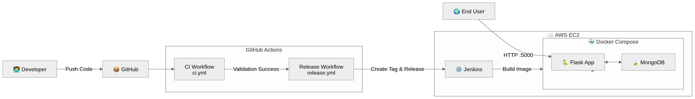
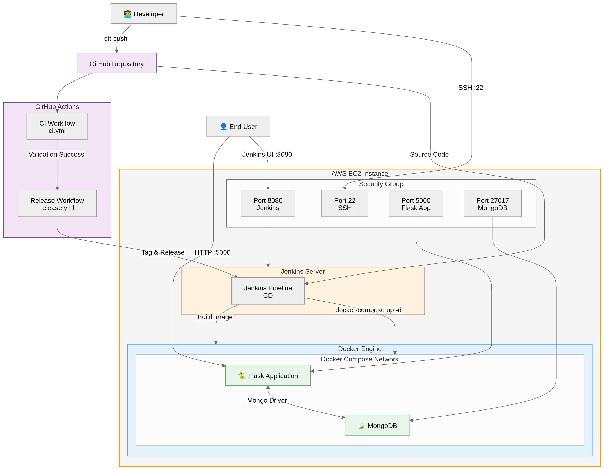
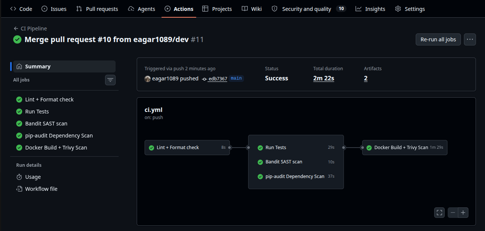
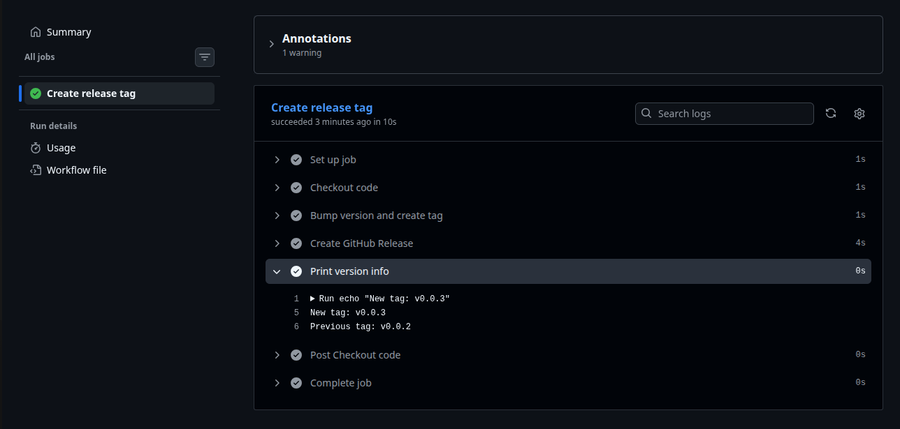
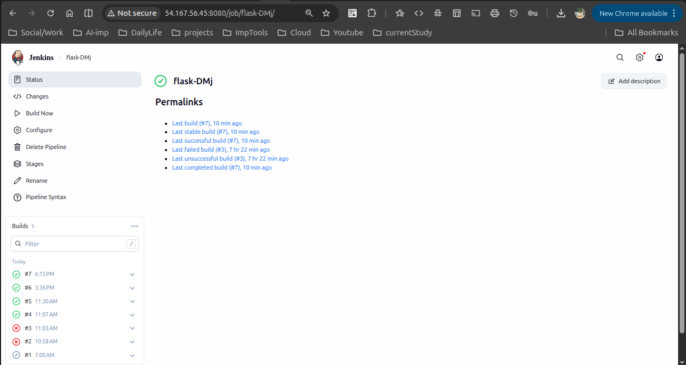
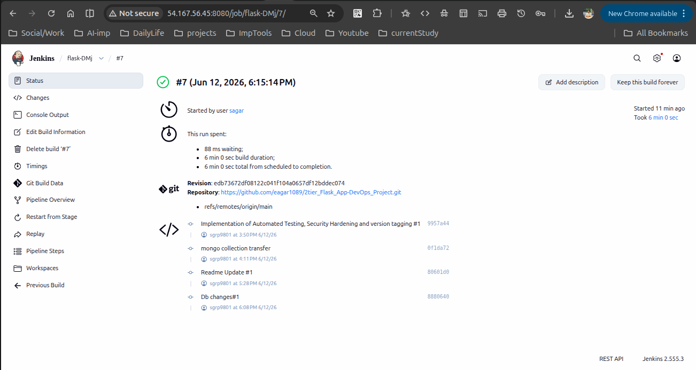
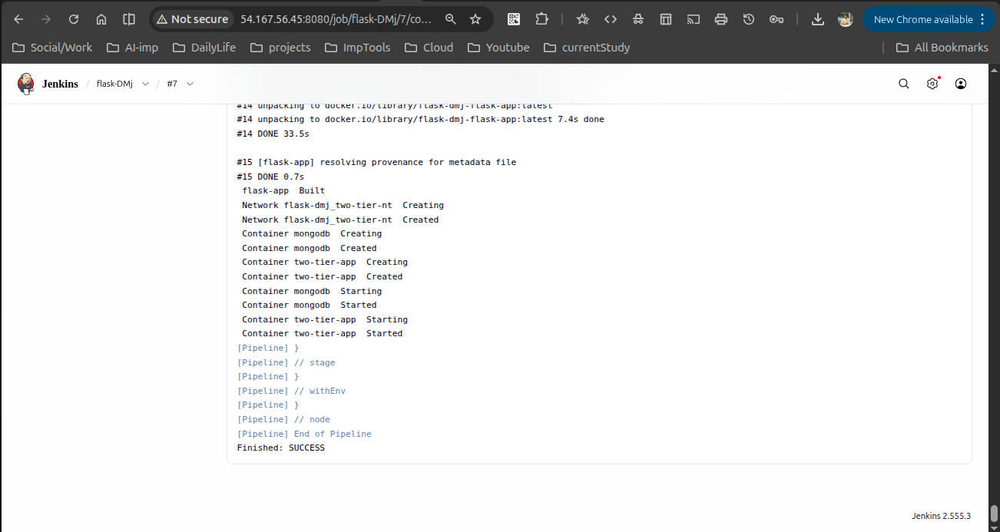
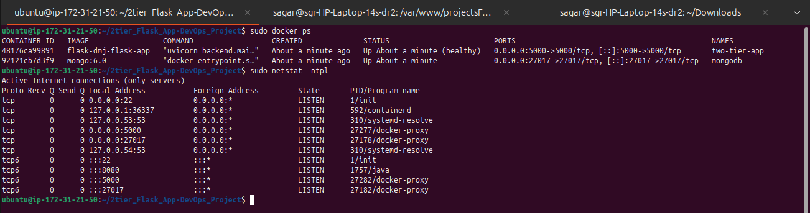
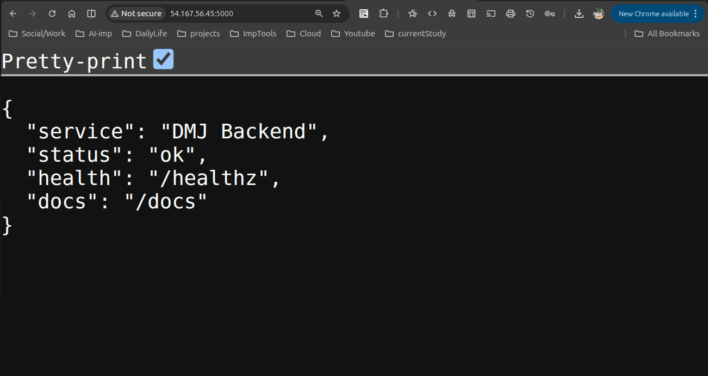
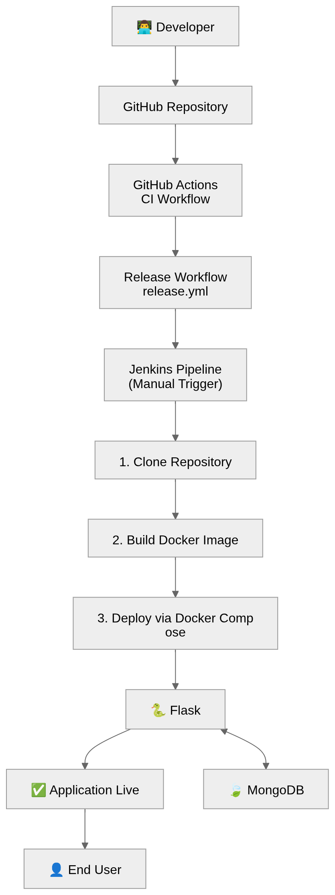

# DevOps Project Report: Automated CI/CD Pipeline for a 2-Tier Flask Application on AWS

A production-style DevOps project featuring a Flask + MongoDB application with fully automated CI/CD using GitHub Actions, Jenkins, Docker, and AWS EC2.

---

<details>
<summary><strong>Project Overview</strong></summary>
<br>

This project demonstrates a complete DevOps lifecycle for a 2-tier web application:

- **Tier 1 - Application Layer:** Python Flask backend handling HTTP requests and business logic
- **Tier 2 - Database Layer:** MongoDB for flexible, persistent NoSQL data storage

The entire software delivery process - from code commit to live deployment - is fully automated using modern DevOps tooling, eliminating manual intervention and human errors.

</details>

---

<details>
<summary><strong>Technology Stack</strong></summary>
<br>

| Category         | Technology                        |
|------------------|-----------------------------------|
| Backend          | Python, Flask                     |
| Database         | MongoDB                           |
| Version Control  | Git, GitHub                       |
| CI               | GitHub Actions                    |
| CD               | Jenkins                           |
| Containerization | Docker                            |
| Orchestration    | Docker Compose                    |
| Cloud            | AWS EC2 (Ubuntu Linux)            |
| Automation       | Shell Scripts, YAML Workflows     |

</details>

---

<details>
<summary><strong>Architecture Diagram</strong></summary>
<br>



</details>

---

<details>
<summary><strong>Infrastructure Diagram</strong></summary>
<br>


</details>

---

<details>
<summary><strong>Project Structure</strong></summary>
<br>

```
2tier_Flask_App-DevOps_Project/
│
├── .github/
│   └── workflows/
│       ├── ci.yml                    # GitHub Actions CI workflow
│       └── release.yml               # Automated release & version tagging
│
├── backend/
│   ├── main.py                       # Main Flask application
│   ├── requirements.txt              # Python dependencies
│   └── templates/                    # HTML templates
│
├── docs/
│   ├── diagrams/
│   │   ├── architecture.png          # System architecture diagram
│   │   ├── Infrastructure.png        # AWS infrastructure diagram
│   │   └── workflow.png              # Pipeline workflow diagram
│   │
│   └── screenshots/
│       ├── ci.png                    # GitHub Actions pipeline
│       ├── consoleoutput.png         # Jenkins console output
│       ├── ec2_services.png          # Docker containers on EC2
│       ├── flaskhealth.png           # Flask health check
│       ├── jobbuild.png              # Jenkins build process
│       ├── jobstatus.png             # Jenkins build status
│       └── version.png               # Version tag information
│
├── Dockerfile                        # Flask app Docker image definition
├── docker-compose.yml                # Multi-container orchestration
├── Jenkinsfile                       # Jenkins pipeline definition
└── README.md
```

</details>

---

<details>
<summary><strong>Setup & Deployment Steps</strong></summary>
<br>

### Prerequisites

- AWS account with EC2 access
- GitHub account
- Docker & Docker Compose installed on EC2
- Jenkins installed on EC2

---

### Step 1 - Launch AWS EC2 Instance

1. Log in to AWS Console → EC2 → **Launch Instance**
2. Choose **Ubuntu 22.04 LTS** AMI
3. Select instance type (`t2.micro` for free tier)
   25gb storage and 2 gb swap 
4. Configure Security Group to allow:
   - Port **22** (SSH)
   - Port **5000** (Flask Application)
   - Port **8080** (Jenkins UI)
   - Port **50000** (Jenkins Agents)
5. Download your `.pem` key pair and launch

---

### Step 2 - Install Dependencies on EC2

SSH into your instance, then run:

```bash
# Update packages
sudo apt update && sudo apt upgrade -y

# Install Docker
sudo apt install docker.io -y
sudo systemctl start docker
sudo systemctl enable docker
sudo usermod -aG docker $USER

# Install Docker Compose
sudo apt install docker-compose -y

# Install Git
sudo apt install git -y

# Install Java (required for Jenkins)
sudo apt install openjdk-17-jdk -y

# Install Jenkins
curl -fsSL https://pkg.jenkins.io/debian/jenkins.io-2023.key | sudo tee \
  /usr/share/keyrings/jenkins-keyring.asc > /dev/null
echo deb [signed-by=/usr/share/keyrings/jenkins-keyring.asc] \
  https://pkg.jenkins.io/debian binary/ | sudo tee \
  /etc/apt/sources.list.d/jenkins.list > /dev/null
sudo apt update && sudo apt install jenkins -y
sudo systemctl start jenkins
sudo systemctl enable jenkins
```

---

### Step 3 - Clone the Repository on EC2

```bash
git clone https://github.com/eagar1089/2tier_Flask_App-DevOps_Project.git
cd 2tier_Flask_App-DevOps_Project
```

---

### Step 4 - Configure GitHub Actions CI

Create `.github/workflows/ci.yml`:

```yaml
name: CI Pipeline

on:
  push:
    branches: [ main ]
  pull_request:
    branches: [ main ]

jobs:
  build:
    runs-on: ubuntu-latest

    steps:
      - name: Checkout Code
        uses: actions/checkout@v3

      - name: Set up Python
        uses: actions/setup-python@v4
        with:
          python-version: '3.10'

      - name: Install Dependencies
        run: |
          pip install -r requirements.txt

      - name: Validate Application
        run: |
          python -m py_compile backend/main.py
          echo "Application validation passed"
```

Screenshot: GitHub Actions CI pipeline running



---

### Step 5 - Configure Automated Release Management

Create `.github/workflows/release.yml`:

```yaml
name: Release

on:
  push:
    branches:
      - main

permissions:
  contents: write

jobs:
  release:
    name: Create release tag
    runs-on: ubuntu-latest

    steps:
      - name: Checkout code
        uses: actions/checkout@v4
        with:
          fetch-depth: 0

      - name: Bump version and create tag
        id: tag_version
        uses: mathieudutour/github-tag-action@v6.1
        with:
          github_token: ${{ secrets.GITHUB_TOKEN }}
          default_bump: patch
          tag_prefix: v

      - name: Create GitHub Release
        uses: softprops/action-gh-release@v2
        with:
          tag_name: ${{ steps.tag_version.outputs.new_tag }}
          name: Release ${{ steps.tag_version.outputs.new_tag }}
          body: ${{ steps.tag_version.outputs.changelog }}

      - name: Print version info
        run: |
          echo "New tag: ${{ steps.tag_version.outputs.new_tag }}"
          echo "Previous tag: ${{ steps.tag_version.outputs.previous_tag }}"
```

Screenshot: Automated version tag created after merge



---

### Step 6 - Configure Jenkins CD Pipeline

1. Open Jenkins at `http://<EC2-PUBLIC-IP>:8080`
2. Unlock Jenkins using the initial admin password:
   ```bash
   sudo cat /var/lib/jenkins/secrets/initialAdminPassword
   ```
3. Install suggested plugins
4. Create a new **Pipeline** job pointed to your GitHub repository
5. Add the following `Jenkinsfile` to the repo root:

```groovy
pipeline {
    agent any

    stages {
        stage('Pull Code') {
            steps {
                git branch: 'main',
                    url: 'https://github.com/eagar1089/2tier_Flask_App-DevOps_Project.git'
            }
        }
        stage('Build Docker Image') {
            steps {
                sh 'docker build -t flask-app .'
            }
        }
        stage('Deploy Containers') {
            steps {
                sh 'docker-compose down || true'
                sh 'docker-compose up -d'
            }
        }
        stage('Health Check') {
            steps {
                sh 'sleep 5 && curl -f http://localhost:5000 || exit 1'
            }
        }
    }
}
```

Screenshots: Jenkins build process and status





---

### Step 7 - Configure Dockerfile

```dockerfile
FROM python:3.11-slim-bookworm AS builder

WORKDIR /app

ENV VENV_PATH=/opt/venv
RUN python -m venv ${VENV_PATH}
ENV PATH="${VENV_PATH}/bin:${PATH}"

COPY backend/requirements.txt .
RUN pip install --no-cache-dir --upgrade pip setuptools wheel && \
    pip install --no-cache-dir -r requirements.txt


FROM python:3.11-slim-bookworm AS runtime

WORKDIR /app

RUN apt-get update && apt-get install -y --no-install-recommends curl && \
    rm -rf /var/lib/apt/lists/*

ENV VENV_PATH=/opt/venv
COPY --from=builder ${VENV_PATH} ${VENV_PATH}
ENV PATH="${VENV_PATH}/bin:${PATH}"

ENV PYTHONPATH=/app

COPY backend/ ./backend/

RUN useradd -m -u 1000 -s /usr/sbin/nologin appuser && \
    chown -R appuser:appuser /app

USER appuser

EXPOSE 5000

HEALTHCHECK --interval=30s --timeout=10s --start-period=40s --retries=3 \
    CMD curl -f http://localhost:5000/health || exit 1

CMD ["uvicorn", "backend.main:app", "--host", "0.0.0.0", "--port", "5000"]
```

---

### Step 8 - Configure Docker Compose

```yaml
version: "3.8"

services:
  mongodb:
    container_name: mongodb
    image: mongo:6.0
    ports:
      - "27017:27017"
    volumes:
      - mongodb_data:/data/db
    networks:
      - two-tier-nt
    restart: always

  flask-app:
    container_name: two-tier-app
    build:
      context: .
    ports:
      - "5000:5000"
    environment:
      - MONGO_HOST=mongodb
      - MONGO_PORT=27017
      - MONGO_DB=dmj
    networks:
      - two-tier-nt
    depends_on:
      - mongodb

volumes:
  mongodb_data:

networks:
  two-tier-nt:
    driver: bridge
```

---

### Step 9 - Run Jenkins Build

Trigger the pipeline job from the Jenkins dashboard and verify each stage in the build console log.

Screenshot: Containers running on EC2



---

### Step 10 - Access the Application

| Service     | URL                               |
|-------------|-----------------------------------|
| Flask App   | `http://<EC2-PUBLIC-IP>:5000`     |
| Jenkins UI  | `http://<EC2-PUBLIC-IP>:8080`     |

Screenshot: Flask application health check



</details>

---

<details>
<summary><strong>CI/CD Pipeline Explained</strong></summary>
<br>



**GitHub Actions** handles Continuous Integration - validating every push automatically, and creating versioned tags and GitHub releases on merge to main.

**Jenkins** handles Continuous Deployment - building fresh Docker images and redeploying containers on every successful CI run, with no manual steps required.

</details>

---

<details>
<summary><strong>Conclusion</strong></summary>
<br>

This project delivers a fully automated, production-style DevOps pipeline for a 2-tier web application. By combining GitHub Actions for CI, Jenkins for CD, Docker for containerization, and AWS EC2 for cloud hosting, it replicates real-world industry workflows end to end.

**Key outcomes:**

- Zero-touch deployment - a code push triggers the entire pipeline automatically
- Consistent environments - Docker eliminates environment-specific failures across machines
- Faster release cycles - automated builds and deployments reduce time-to-production
- Reliable and repeatable - every deployment follows the same defined pipeline stages
- Cloud-ready - hosted on AWS EC2 with proper security group and network configuration

This project demonstrates core DevOps engineering skills including CI/CD pipeline design, containerization, cloud infrastructure management, and automation - applicable to roles in DevOps Engineering, Cloud Engineering, and Site Reliability Engineering.

</details>

---

## Author

**Sagar** - [GitHub Profile](https://github.com/eagar1089)
